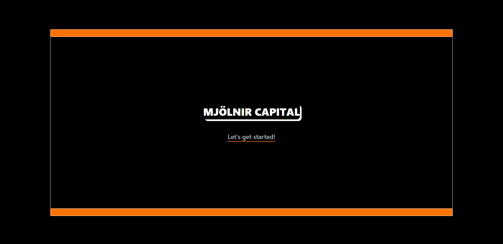
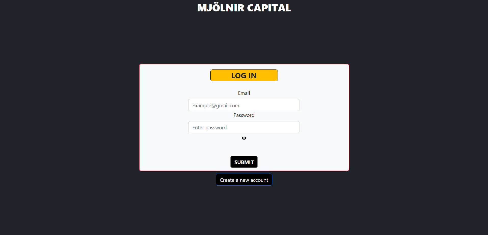
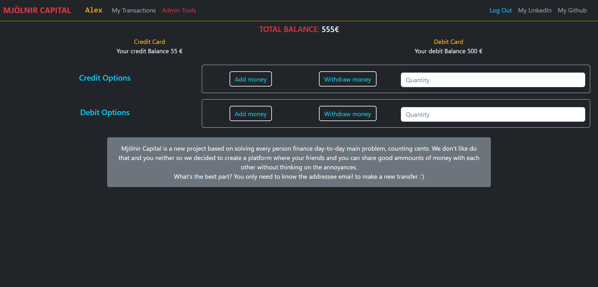
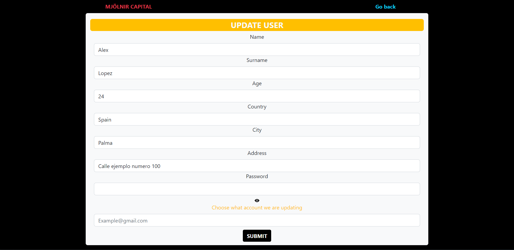
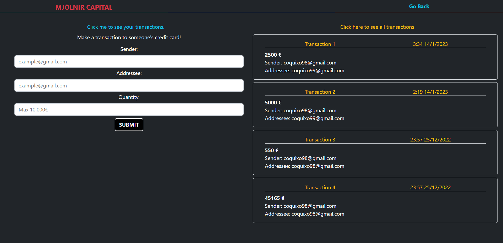

# MJÖLNIR CAPITAL

## General Information

> <h6> This project is the BackEnd part from a ReactJs made Bank page webside.</h6>
> 
Mjölnir capital tries to simplify transactions between it's users.

---

## Deployment

https://master.d3fws9ljq1bmzm.amplifyapp.com/welcome

---

## Appendix

Some of the funcionalities are:

- Register / Log In
- Create new wallet with credit/debit card
- Add and Withdraw Money
- Update profile
- Check your transactions
- Make a new transaction to someone's credit card
- Bring all transactions users (as an admin

Futhermore the web is movile responsive

---

## Table of content

- [Mjölnir Capital](#mjölnir-capital)
- [General Information](#general-information)
- [Appendix](#appendix)
- [Repositories](#repositories)
- [Views](#views)
- [Technologies](#technologies-dependencies-and-libraries)
- [Authors](#authors)
- [Badges](#badges)

---

## Repositories

[Front End](https://github.com/Coquixo/final-project-front)

[Back End](https://github.com/Coquixo/final-project-back)

---

## Views

Welcome View

Login / Register View

Balances View

Profile View

Transactions View

## Technologies, dependencies and libraries

Front End:

- [HTML5](https://html5.org/)
- [SCSS](https://sass-lang.com/)
- [CSS3](https://developer.mozilla.org/en-US/docs/Web/CSS)
- [JavaScript](https://www.javascript.com/)
- [ReactJS](https://es.reactjs.org/)
- [Redux](https://redux.js.org//)

Back End:

- [JavaScript](https://www.javascript.com/)
- [Node](https://nodejs.org/en/)
- [Express](https://expressjs.com/)
- [Sequelize](https://sequelize.org/)
- [Bcryptt](https://www.npmjs.com/package/bcrypt)
- [Axios](https://axios-http.com//)
- [MySQL](https://www.mysql.com/)

---

## Authors

Alex Marcelo López Quiroga

- [Linked In](https://www.linkedin.com/in/alex-marcelo-l%C3%B3pez-quiroga-05a7b2194/)
- [Github](https://github.com/Coquixo)

---

## Badges

---

[BackToTop](#appendix)
